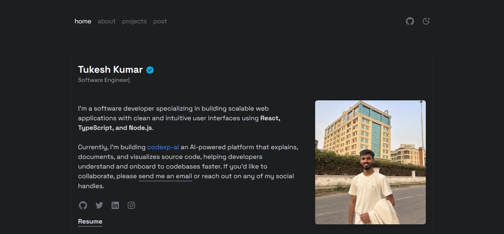

A modern, portfolio website which is clean and build with cutting-edge technologies and optimized for performance, SEO, and user experience.

 

**Visit:** [https://tukesh.sbs](https://tukesh.sbs)

##  Features

####  **Modern Design**
- **Responsive Design** optimized for all devices
- **Minimalist UI** with clean, professional aesthetics

#### 🔍 **SEO Optimized**
- **Dynamic Sitemap** generation
- **Structured Data (JSON-LD)** for rich search results
- **Meta Tags & Open Graph** for social sharing
- **Performance Optimized** with Next.js 15

#### 📱 **Progressive Web App**
- **PWA Manifest** for app-like experience
- **Optimized Images** with Next.js Image component
- **Fast Loading** with static generation

#### 🛠 **Developer Experience**
- **TypeScript** for type safety
- **ESLint** for code quality
- **Tailwind CSS** for styling
- **Component Architecture** for maintainability

##  Tech Stack

#### *Frontend*
```⚡ Next.js 15.2.0      - React framework with App Router
 Tailwind CSS 3.4   - Utility-first CSS framework
 TypeScript 5.0      - Type-safe JavaScript
 Framer Motion       - Animation library
 next-themes        - Dark/Light theme switching
```

#### *Tools & Libraries*
```
React Icons        - Icon library
GitHub Calendar    - Contribution    visualization
Space Grotesk      - Modern typography
```

#### *Development*
```
ESLint             - Code linting
PostCSS            - CSS processing
npm                - Package management
```

### 🛠 Installation & Setup

#### *Prerequisites*
- Node.js 18+ 
- npm or yarn

#### *Clone & Install*
```bash
# Clone the repository
git clone https://github.com/tukesh1/tukesh.sbs.git

# Navigate to project directory
cd tukesh.sbs

# Install dependencies
npm install
```

#### *Development*
```bash
# Start development server
npm run dev

# Open http://localhost:3000
```

#### *Build & Deploy*
```bash
# Build for production
npm run build

# Start production server
npm start

# Lint code
npm run lint
```

### Running this Portfolio in Docker

#### 1. Build the Docker Image
Build your Docker image with the following command:

```bash
docker build -t tukesh-sbs .
```
Run the container and map it to port 3000:
```bash
docker run -p 3000:3000 tukesh-sbs .
```
You can now access this portfolio at http://localhost:3000

### Performance

- **Lighthouse Score:** 95+ across all metrics
- **Core Web Vitals:** Optimized for speed
- **SEO Score:** 100/100
- **Accessibility:** WCAG compliant


## 🤝 Contributing

1. Fork the repository
2. Create your feature branch (`git checkout -b feature/amazing-feature`)
3. Commit your changes (`git commit -m 'Add amazing feature'`)
4. Push to the branch (`git push origin feature/amazing-feature`)
5. Open a Pull Request


## 📄 License

This project is open source and available under the [MIT License](LICENSE).

---

<div align="center">

*Built with ❤️ by [Tukesh Kumar](https://tukesh.sbs)*

*Frontend Developer & AI Engineer*
</div>